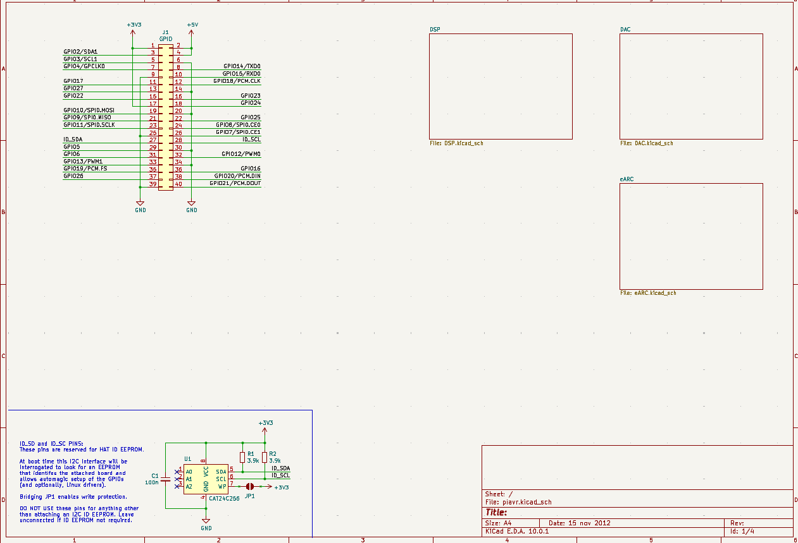
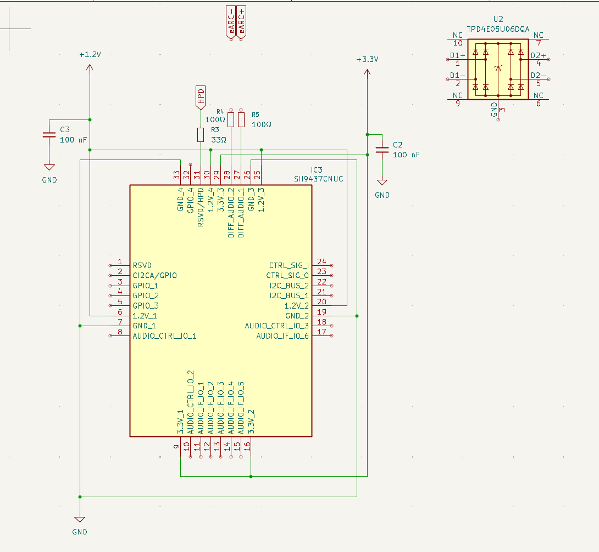
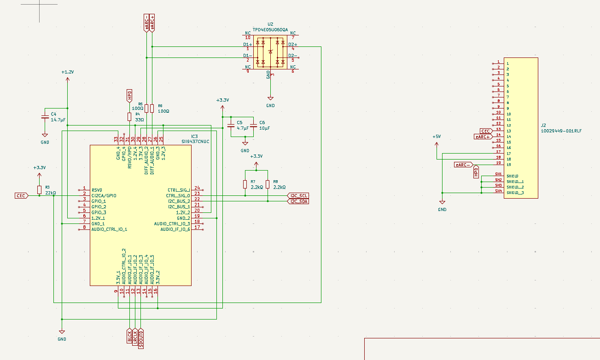
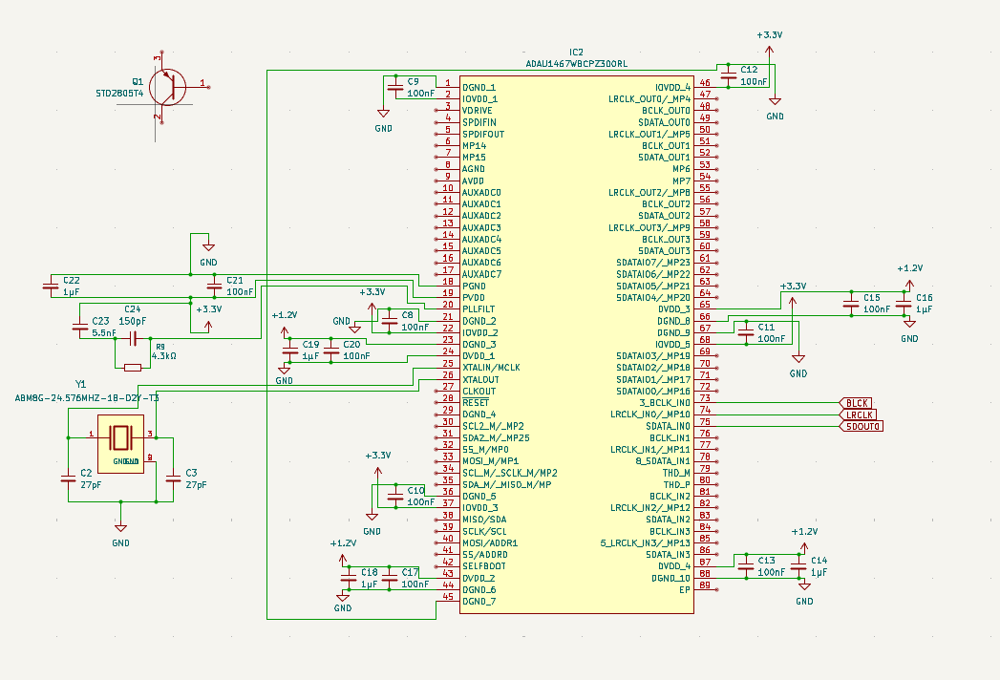

## May 11th, 2026: Started with pcb design

I started adding all the chips I needs to make this functional. I already know this is going to be a probably way to large project, but I'm committed now! The eArc chip is a SII9437CNUC, the DSP chip is a ADAU1467WBCPZ300 (90 pins TwT), and the DAC chip is a AK4458. I'm going for 32-bit audio, probably with 192 kHz bitrate (I wish it could go higher, but the DSP that's limiting this is already $22 USD). eaearch took a little bit, but I'm almost done with it!

**Total time spent: 2h**

## May 14th, 2026: EARC reciever

I started wiring up the eARC reciever for the audio input. I'm using some decoupling capacitors on the voltage lines. Then I started wiring up some esd diodes and resistors help with crosstalk on the hdmi cable running into the HAT.

**Total time spent: 1.5h**

## May 15th, 2026: Finished eARC reciever, started DSP

I finished wiring up the eARC reciever up to the hdmi, and the pins over to the DSP. Then, I started working on input, power, and clock for the DSP. The DSP has a lot of decoupling capacitors as well as current regulators and resistors.

**Total time spent: 2.5h**